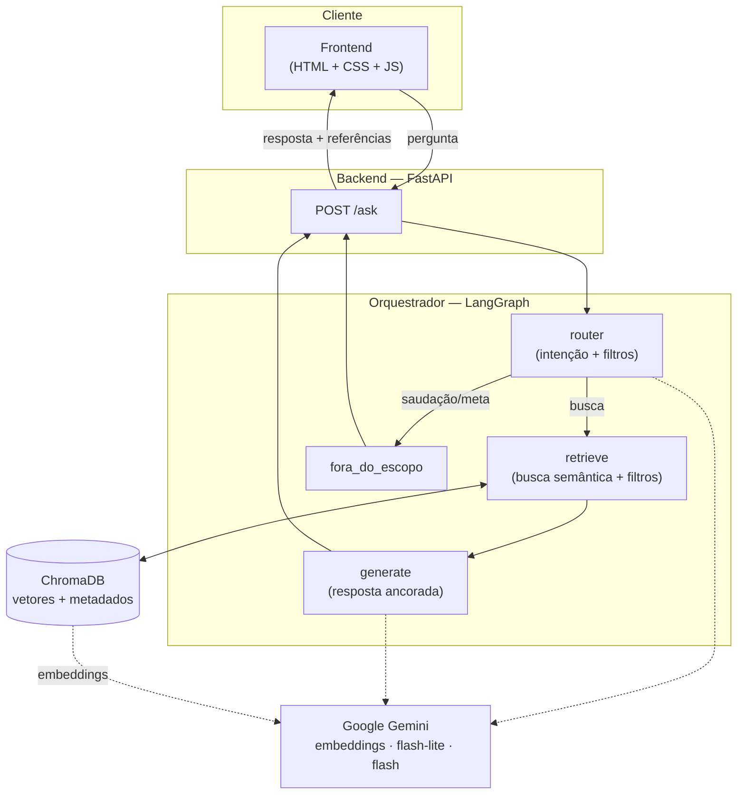
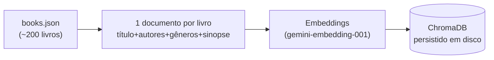

# Arquitetura

## Visão geral

## Pipeline de ingestão (offline)

## Decisão central: por que LangGraph com router (e não multi-agente nem SQL)

- **Volume pequeno (~200 livros)** não justifica orquestração multi-agente. Um grafo
  `router → retrieve → generate` entrega a estrutura de orquestrador de forma enxuta e defensável.
- **Filtros** ("infantis após 2015") são resolvidos com **filtro de metadados nativo do ChromaDB**,
  sem precisar de um agente text-to-SQL. SQL só se justificaria com dados relacionais/analíticos
  (ex.: dados de venda, agregações), que não fazem parte deste catálogo.
- O **router** separa "precisa de busca" de "saudação/meta" e extrai filtros estruturados,
  dando um ponto único e observável de decisão.
